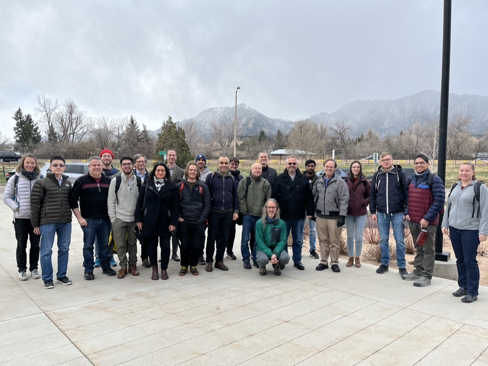

The Climate Process Team (CPT) aims to implement, assess, improve, and unify recent work on energetically-consistent ocean eddy momentum and tracer parametrizations in ocean-only and coupled climate models to improve model fidelity. 

<!--more-->

More infos on our [website](https://ocean-eddy-cpt.github.io/) 

Below, a group picture at our conference in Boulder in April 2022

